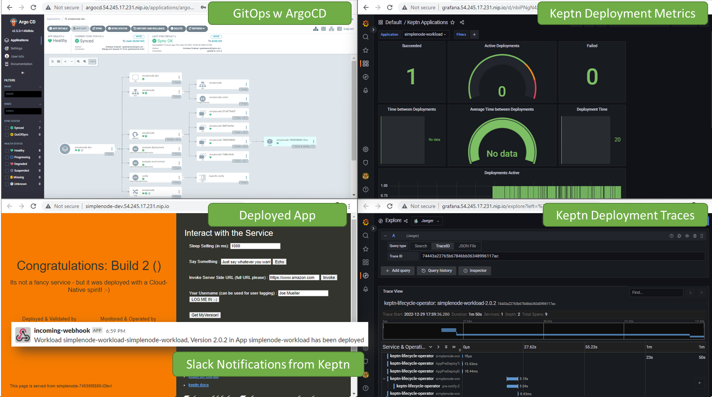

# Keptn Lifecycle Toolkit Demo with ArgoCD

This is a demo repository for [Keptn Lifecycle Toolkit (KLT)](https://lifecycle.keptn.sh/)

The purpose is experiment with KLT on some simple demo apps and show different Use Cases such as
* Sending Slack Notifications for every deployment
* Post Deployment Validations against Prometheus and Dynatrace SLOs
* Pre Deployment Dependency Checks
* ...

# Demo Setup Explained

If you follow the demo instructions you will get
1. k8s cluster: If you dont have one you just need a Linux machine!
2. KLT based on [Getting Started with KLT](https://lifecycle.keptn.sh/docs/getting-started/)
3. Observability (Grafana, Prometheus, Jaeger) based on [Observability for KLT](https://github.com/keptn-sandbox/lifecycle-toolkit-examples/tree/main/support/observability) 
4. ArgoCD based on [ArgoCD for KLT](https://github.com/keptn-sandbox/lifecycle-toolkit-examples/tree/main/support/argo)
5. Exposed Grafana, Jaeger and ArgoCD through Ingress, e.g: grafana.1.2.3.4.nip.io
6. A Sample app deployed with Argo
7. Slack Notifications every time the app is deployed!

Here is a screenshot of my demo installation - takes about 5 minutes to get here!


Now lets get to the installation!

# Manual Demo Installation: Step-by-Step

The following are the 9 individual steps so you see how to setup everything up.
If you want some help - go to the next section which uses the install-klt-on-k3s.sh.

## 1. k8s cluster

**If you already have a cluster** then you are good. Just make sure that you have an ingress controller (Traefik, Nginx, ...) installed that handles inbound traffic on the public IP of your machine. If you already have a wildcard DNS for your ingress then great - otherwise we will use nip.io as a free DNS service. This allows us to later access our demo services via e.g: argocd.yourIP.nip.io or grafana.yourIP.nip.io
Please export your ingress domain like this:
```
export INGRESS_DOMAIN=11.22.33.44.nip.io
```

**If you do not have a cluster** then here is how I setup my demo cluster:
I use an AWS EC2 Instance with Amazon Linux 2 with the following properties:
```
Instance Type: t3.2xlarge
Storage: 50GB
Security: http, https & ssl ports open
```

**Install updates and tools:**
```
sudo yum update -y
sudo yum install git -y
sudo yum install curl -y
sudo yum install jq -y
sudo yum install tree -y
sudo wget https://github.com/mikefarah/yq/releases/download/3.4.1/yq_linux_amd64 -O /usr/bin/yq && sudo chmod +x /usr/bin/yq
sudo yum install docker
```

**Install k3s:**
```
sudo curl -sfL https://get.k3s.io | K3S_KUBECONFIG_MODE="644"  sh -
```

**Set public IP as Ingress Domain (+nip.io)**
```
export INGRESS_DOMAIN=$(curl -s http://169.254.169.254/latest/meta-data/public-ipv4).nip.io
```

**VALIDATE STEP**

Run `kubectl get nodes` and wait until the status of your node is ready. 
It should look something like this: 
```
$ kubectl get nodes
NAME                                          STATUS   ROLES                  AGE    VERSION
ip-1xx-3x-4x-1xx.us-west-x.compute.internal   Ready    control-plane,master   109s   v1.25.4+k3s1
```

## 2. Clone this git repo

```
git clone https://github.com/keptn-sandbox/klt-on-k3s-with-argocd
cd klt-on-k3s-with-argocd

```

## 3. (Optional) Install Dynatrace OneAgent

This is optional. But as I work a lot with Dynatrace I suggest you install the OneAgent Operator for K8s.

Either
1. follow the [Get started with Dynatrace Kubernetes Monitoring Doc](https://www.dynatrace.com/support/help/setup-and-configuration/setup-on-container-platforms/kubernetes/get-started-with-kubernetes-monitoring)
2. walk through the *Deploy Dynatrace* Wizard in the Dynatrace UI
3. export your tenant_id, operator and data ingest token and then follow the following instructions

```
export DT_TENANT=abc12345.live.dynatrace.com
export DT_OPERATOR_TOKEN=dt0c01.XXXXXXXXXXXXXXXXXXXXXXXXXXXXXXXXXXXXXXXXXXXXXXXXXXXXXY
export DT_INGEST_TOKEN=dt0c01.YYYYYYYYYYYYYYYYYYYYYYYYYYYYYYYYYYYYYYYYYYYYYYYYYYYY

kubectl create namespace dynatrace
kubectl apply -f https://github.com/Dynatrace/dynatrace-operator/releases/download/v0.10.1/kubernetes.yaml
kubectl -n dynatrace wait pod --for=condition=ready --selector=app.kubernetes.io/name=dynatrace-operator,app.kubernetes.io/component=webhook --timeout=300s

kubectl -n dynatrace create secret generic keptn --from-literal="apiToken=$DT_OPERATOR_TOKEN" --from-literal="dataIngestToken=$DT_INGEST_TOKEN"
sed -e 's~DT_TENANT~'"$DT_TENANT"'~' ./klt-on-k3s-with-argocd/setup/dynatrace/dynakube_10.yaml > dynakube_10_tmp.yaml
kubectl apply -f dynakube_10_tmp.yaml
rm dynakube_10_tmp.yaml
```

**VALIDATE STEP**
You should see the Kubernetes Cluster show up in your Dynatrace Kubernetes Dashboards.
You can also run `kubectl get dynakube -n dynatrace` and should see this after a while:
```
$ kubectl get dynakube -n dynatrace
NAMESPACE   NAME    APIURL                                    TOKENS   STATUS    AGE
dynatrace   keptn   https://abc12345.live.dynatrace.com/api   keptn    Running   3m29s
```

**TIP:** I also suggest to turn on Kubernetes Events and Prometheus monitoring in your Dynatrace Settings

## 4. Install Keptn Lifecycle Toolkit (KLT)

First we install the Cert Manager
```
kubectl apply -f https://github.com/cert-manager/cert-manager/releases/download/v1.10.0/cert-manager.yaml
kubectl wait --for=condition=Available deployment/cert-manager-webhook -n cert-manager --timeout=60s

```

Then the Keptn Lifecycle Toolkit itself
```
kubectl apply -f https://github.com/keptn/lifecycle-toolkit/releases/download/v0.4.1/manifest.yaml
kubectl wait --for=condition=Available deployment/klc-controller-manager -n keptn-lifecycle-toolkit-system --timeout=120s

```

**VALIDATE STEP**
Both `kubectl wait` should come back successfully!

## 5. Install Observability for KLT

The KLT example repo has a nice way to install Grafana, Prometheus and Jaeger. I copied the files and modified it slightly to easily expose Grafana, Prometheus and Jaeger via our Ingress:

```
cd setup/observability
make install

```

To access Grafana and Jaeger via the Browser we define our ingress
```
cd ../..
sed -e 's~domain.placeholder~'"$INGRESS_DOMAIN"'~' ./setup/ingress/grafana-ingress.yaml.tmp > grafana-ingress_gen.yaml
kubectl apply -f grafana-ingress_gen.yaml
rm grafana-ingress_gen.yaml
echo "Access me via http://grafana.$INGRESS_DOMAIN and http://jaeger.$INGRESS_DOMAIN"

```

**VALIDATE STEP**
Open the links as shown in the output. For Grafana login with `admin/admin`. Then change the password upon first login! When you browse the Default dashboards you should also see the default Keptn dashboards!

## 6. Install ArgoCD for KLT

The KLT example repo also has a nice way to install ArgoCD. I copied the files and modified it slightly:

```
cd setup/argo
make install

```

To access ArgoCD via our browser we want to define our ingress
```
cd ../..
sed -e 's~domain.placeholder~'"$INGRESS_DOMAIN"'~' ./setup/ingress/argocd-ingress.yaml.tmp > argocd-ingress_gen.yaml
kubectl apply -f argocd-ingress_gen.yaml
rm argocd-ingress_gen.yaml

ARGOPWD=$(kubectl -n argocd get secret argocd-initial-admin-secret -o jsonpath="{.data.password}" | base64 -d)
echo "Access me via http://argocd.$INGRESS_DOMAIN"
echo "Login with admin/$ARGOPWD"

```

**VALIDATE STEP**
Open the link shown above. It should bring you to ArgoCD where you can login with `admin` and the password provided in the output!


## 7. (Optional) Setup Slack Notification

For this you need a Slack Workspace with the installed Incoming Webhook Extensions. Create a new Webhook Configuration and get the Webhook URL, e.g: https://hooks.slack.com/services/YOURHOOKAAAAAAAA/BBBBBBB/CCCCCCCC. Then take the WebHook Part of that URL and do the following:

```
kubectl create secret generic slack-notification --from-literal=SECURE_DATA='{"slack_hook":"YOURHOOKAAAAAAAA/BBBBBBB/CCCCCCCC","text":"Deployed Simplenode"}' -n simplenode-dev -oyaml --dry-run=client > tmp-slack-secret.yaml
kubectl create ns simplenode-dev
kubectl apply -f tmp-slack-secret.yaml
rm tmp-slack-secret.yaml

```

## 8. Lets Clone our Repo for ArgoCD

ArgoCD has a concepts of projects and applications. One way is to define an ArgoCD App and let it point to a Git Repository that it then synchronizes to your K8s Cluster. To make this work everyone that runs this demo needs their own GitHub repository so that you can also modify your app definition, e.g: increase the version. Therefore you need to to the following

1. FORK this GitHub repo in our own GitHub account, e.g: https://github.com/yourgithubaccount/your-klt-demo-repo
2. In the simplenode-xxx folders replace all occurences of domain.placeholder with the value in $INGRESS_DOMAIN
3. Then export the repo identify to GITHUBREPO like this: `export GITHUBREPO=yourgithubaccount/your-klt-demo-repo`

## 9. Create Argo App for our new repo

```
sed -e 's~gitrepo.placeholder~'"$GITHUBREPO"'~' ./argocd/app-dev.yaml.tmp > app-dev.yaml
kubectl apply -f app-dev.yaml
rm app-dev.yaml
```

You should now see the new App in ArgoCD and ArgoCD doing its work. If everything goes well you should be able to
1. Browse to https://simplenode-dev.$INGRESS_DOMAIN and see the app deployed
2. Get a Slack Notification after the deployment is done
3. Get data in the Keptn Grafana Dashboards
4. See Open Telemetry Traces for the deployment

# Automated Demo Installation

## 1. Pre-Requ Steps
Above steps can be mostly automated but you need to do this:
**Do Step 2: Clone the Repo**
```
git clone https://github.com/grabnerandi/klt-on-k3s-with-argocd
cd klt-on-k3s-with-argocd
```

**Do Step 8: Forke the Demo Repo**
1. FORK this GitHub repo in our own GitHub account, e.g: https://github.com/yourgithubaccount/your-klt-demo-repo
2. In the simplenode-xxx folders replace all occurences of domain.placeholder with the value in $INGRESS_DOMAIN
Then
```
export GITHUBREPO=yourgithubaccount/your-klt-demo-repo
```

**Optionally Do this from Step 3: If you want to install Dynatrace OneAgent**
```
export DT_TENANT=abc12345.live.dynatrace.com
export DT_OPERATOR_TOKEN=dt0c01.XXXXXXXXXXXXXXXXXXXXXXXXXXXXXXXXXXXXXXXXXXXXXXXXXXXXXY
export DT_INGEST_TOKEN=dt0c01.YYYYYYYYYYYYYYYYYYYYYYYYYYYYYYYYYYYYYYYYYYYYYYYYYYYY
```

**Optionally Do this from Step 7: Export your Slack WebHook**
```
export SLACK_HOOK=YOURHOOKAAAAAAAA/BBBBBBB/CCCCCCCC
```

## 2. Execute the script

The script will install tools, k3s, observability, argocd and - depending on your other set env-variables OneAgent, Slack Integration and creates the ArgoCD App for the forked repository. 

```
install-klt-on-k3s.sh
```


# How to uninstall?

If you installed the k3s cluster then simply execute
```
k3s-uninstall.sh
```